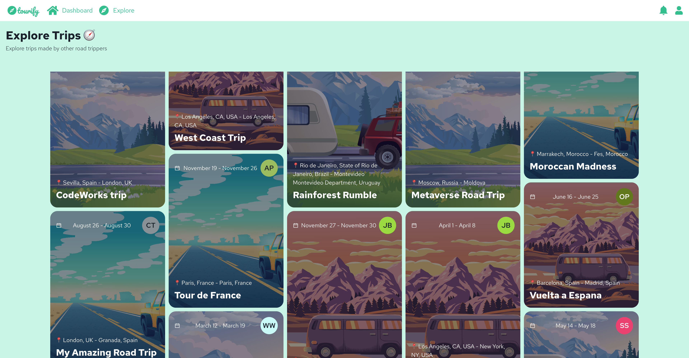
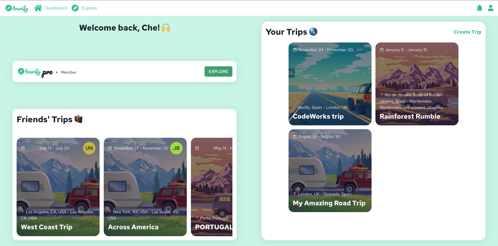
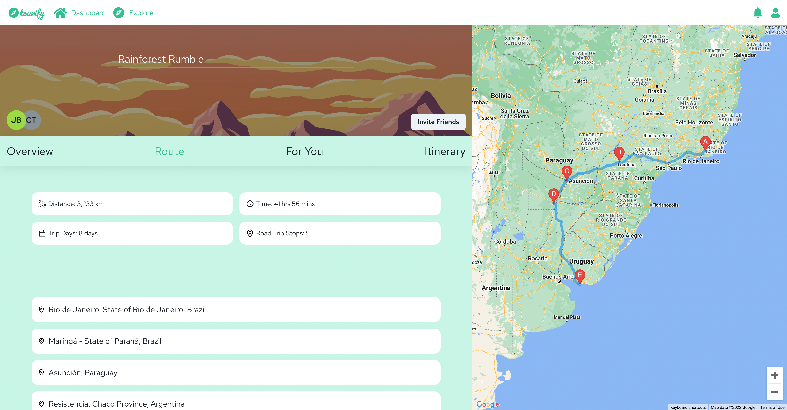

  

<strong>Tourify is an all-in-one road trip application to help you plan and organise your road trips from scratch.</strong>

1. Start creating your route by giving it a name, some dates and adding places to your route, which will be displayed using Google Maps API
2. Changed your mind? Add or delete a few more places, or rearrange the order easily, simply by dragging and dropping.
3. Check out the daily, detailed overview of each route, including distance, time and even estimated fuel cost, as well as the ability to view the route in google maps.
4. Got a landmark you want to visit? Add it to your itinerary on the day you want
5. Use the suggested feature to find restaruant, hotels or even fuel stations along your route
6. Feeling lonely? Invite a friend, they can accept your invite and view the plan

## Screenshots

  
  
  

## Tech Stack

<strong>FRONTEND:</strong>

- [JavaScript](https://www.javascript.com)
- [React](https://reactjs.org) - build user interface
- [Google Maps API](https://developers.google.com/maps) - display maps and location services
- [Chakra UI](https://chakra-ui.com) - modular component library with prebuilt react components

<strong>BACKEND:</strong>

- [NodeJS](https://nodejs.org)
- [Express](https://expressjs.com) - Node.JS backend framework
- [PassportJS](https://www.passportjs.org) - Authentication for NodeJS applications
- [Stripe](https://stripe.com) - Payments integration
- [MongoDB](https://www.mongodb.com) - Non-relational database

This app is deployed using [Vercel](https://vercel.com) for the frontend and [Fly.io](https://fly.io) for the backend.

### Visit [tourify.me](https://tourify.me) for a live demo

## Author

Che Theaker - [Github](https://github.com/chetheaker) - [LinkedIn](https://www.linkedin.com/in/chetheaker/)
